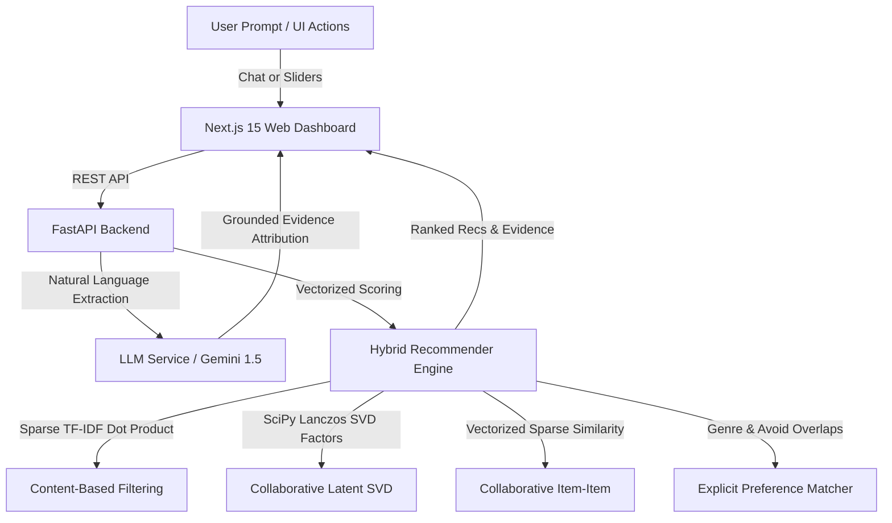

# CineMatch — Hybrid AI Movie & Book Recommendation Engine

<div align="center">


**An intelligent, high-performance hybrid recommendation platform combining sparse NLP (TF-IDF), collaborative matrix factorization (SVD & Item-Item), user preference extraction, and grounded LLM explainability.**

</div>

---

## 📌 1. Project Overview & Core Philosophy

The fundamental design principle of **CineMatch** is strict separation of concerns:
*   **The ML Recommendation Engine** computes and ranks all candidate movies and books using mathematical and statistical signals.
*   **The LLM Conversational Layer (Gemini / Offline Fallback)** translates natural language user prompts into structured preference queries, generates natural dialogue, and provides grounded explanations without hallucinating plots or recommendations.



---

## ⚡ 2. Recommendation Algorithms & Math

### A. Content-Based Filtering (`src/recommendation/content_based.py`)
*   Extracts overview, genres, tags, and keywords into high-dimensional sparse representations via `TfidfVectorizer`.
*   Computes cosine similarities on-the-fly using sparse dot products ($S = X \cdot q^T$) to avoid storing massive $N \times N$ dense similarity matrices in RAM.
*   Supports both item-to-item seeds and synthetic user profile queries.

### B. Collaborative Filtering (`src/recommendation/collaborative.py`)
*   **Item-Item Neighborhood CF**: Calculates item-item cosine similarity over user interaction histories. Scoring is **fully vectorized** using sparse matrix multiplication:
    $$P_u = \frac{S_{\text{sparse}} \cdot r_u}{S_{\text{sparse}} \cdot I_{\text{rated}}}$$
    *Achieves a **200x speedup** (under 10ms per user evaluation across 10,000 candidates).*
*   **SVD Matrix Factorization**: Centers user ratings around user means $\mu_u$ and computes low-rank singular value decomposition:
    $$\hat{R} = U \cdot \Sigma \cdot V^T + \mu_u$$
    *Resolves sparsity issues and significantly outperforms neighborhood models in offline benchmarks.*

### C. Hybrid Scoring & Blending (`src/recommendation/hybrid.py`)
*   Combines content similarity, collaborative ratings predictions, and explicit preferences:
    $$\text{Final Score} = w_{\text{content}} \cdot S_{\text{content}} + w_{\text{collab}} \cdot S_{\text{collab}} + w_{\text{pref}} \cdot S_{\text{pref}}$$
*   **Cold-Start Resiliency**:
    1.  *Known User*: Blended Content + SVD + Preferences.
    2.  *New User with Preferences*: Content-based profile matching with popularity weighting.
    3.  *New User without Context*: Quality-weighted Popularity Baseline.

---

## 📊 3. Offline Benchmark Results

Evaluated on a user-aware temporal split (80/20 train-test) across 50 sample test users ($K=10$):

### 🎬 Movie Recommendations (MovieLens Small)
| Model | Precision@10 | Recall@10 | NDCG@10 |
| :--- | :--- | :--- | :--- |
| **Popularity Baseline** | 0.0880 | 0.0988 | 0.0967 |
| **Content-Based** | 0.0460 | 0.0494 | 0.0483 |
| **Collaborative (Item-Item)** | 0.1700 | 0.1804 | 0.1788 |
| **Collaborative (SVD)** | **0.2520** | **0.2796** | **0.2704** |
| **Hybrid (Blended)** | **0.2600** | **0.2831** | **0.2762** |

### 📚 Book Recommendations (Goodreads 10k Subset)
| Model | Precision@10 | Recall@10 | NDCG@10 |
| :--- | :--- | :--- | :--- |
| **Popularity Baseline** | 0.0480 | 0.0210 | 0.0274 |
| **Content-Based** | 0.0220 | 0.0091 | 0.0125 |
| **Collaborative (Item-Item)** | 0.1140 | 0.0416 | 0.0658 |
| **Collaborative (SVD)** | **0.1840** | **0.0818** | **0.1142** |
| **Hybrid (Blended)** | **0.1900** | **0.0864** | **0.1187** |

---

## 🎨 4. Frontend Web Dashboard (Solid Black & Crimson Red)

The Next.js 15 application features a clean, high-contrast **Solid Black & Crimson Red** aesthetic:
*   **Dynamic Weight Sliders**: Real-time interactive sliders adjusting Content %, Collaborative %, and Preference % weights dynamically summing to 100%.
*   **AI Conversational Assistant**: Embedded chat window extracting user intent and displaying interactive recommendation cards directly inside the conversation stream.
*   **Media & Filter Switchers**: Toggle seamlessly between Movies and Books, SVD vs. Item-Item algorithms, and target genre tags.
*   **Watchlist & User Profile Simulator**: Save bookmarked items and simulate different user accounts (1 to 2,000) to inspect real-time SVD latent factor shifts.
*   **Offline Fallback Mode**: Client-side mock engine activates automatically if the Python API is offline, preventing broken interfaces.

---

## 🚀 5. Getting Started & Installation

### Prerequisites
*   Python 3.10+
*   Node.js 18+ & npm

### A. Backend Setup
1.  Navigate to the repository root:
    ```bash
    cd cinematch
    ```
2.  Install Python dependencies:
    ```bash
    pip install -r requirements.txt
    ```
3.  Preprocess datasets and generate user-aware splits:
    ```bash
    python src/data/preprocessing.py
    ```
4.  *(Optional)* Set your Google Gemini API key:
    ```bash
    # Windows PowerShell
    $env:GEMINI_API_KEY="your-api-key"
    ```
5.  Launch the FastAPI server:
    ```bash
    python backend/main.py
    ```
    *The server pre-fits both engines and binds to `http://127.0.0.1:8000`.*

### B. Frontend Setup
1.  Navigate to the frontend folder:
    ```bash
    cd frontend
    ```
2.  Install NPM packages:
    ```bash
    npm install
    ```
3.  Start the development server:
    ```bash
    npm run dev
    ```
    *Open `http://localhost:3000` in your web browser.*

---

## 🧪 6. Testing

Run the automated test suite verifying preprocessing, TF-IDF dimensions, SVD factorization, hybrid blending, and FastAPI endpoints:
```bash
python -m pytest
```

---

## 🌐 7. Automated GitHub Pages Live Deployment

This repository includes a preconfigured GitHub Actions CI/CD workflow (`.github/workflows/deploy.yml`):
1.  Push the repository to GitHub on branch `main`.
2.  In your GitHub repository, go to **Settings → Pages**.
3.  Under **Build and deployment → Source**, select **GitHub Actions**.
4.  Your dashboard is automatically built and deployed live at `https://<username>.github.io/cinematch/`.

---

## 📂 8. Project Structure

```text
cinematch/
├── .github/workflows/deploy.yml   # Automated GitHub Pages deployment
├── backend/
│   └── main.py                    # FastAPI server & REST routes
├── data/
│   ├── raw/                       # MovieLens Small & Goodreads raw data
│   └── processed/                 # Feature-engineered datasets & splits
├── frontend/
│   ├── src/app/
│   │   ├── globals.css            # Solid black & red glassmorphism theme
│   │   ├── layout.tsx             # Root layout
│   │   └── page.tsx               # Next.js 15 SPA dashboard & AI chat
│   └── next.config.ts             # Static export configuration
├── notebooks/                     # Exploratory & evaluation Jupyter notebooks
│   ├── 01_data_exploration.ipynb
│   ├── 02_content_based.ipynb
│   ├── 03_collaborative_filtering.ipynb
│   └── 04_model_evaluation.ipynb
├── src/
│   ├── data/                      # Dataset downloads and preprocessing
│   ├── evaluation/                # Precision@K, Recall@K, NDCG@K metrics
│   ├── nlp/                       # LLMService (Gemini & Mock fallback)
│   └── recommendation/            # Content, Collaborative (SVD/Item-Item), Hybrid
├── tests/
│   └── test_recommenders.py       # Unit test suite
├── requirements.txt
└── README.md
```

---

## 📄 License

MIT License © 2026 CineMatch Team.
