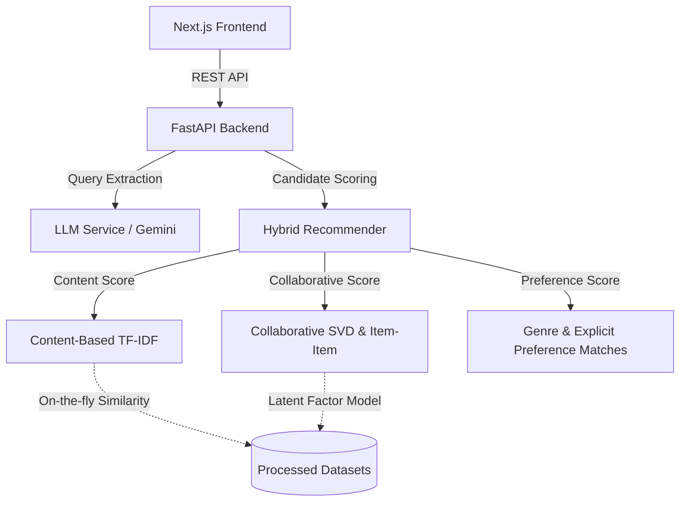

# CineMatch — Hybrid AI Movie & Book Recommendation Engine

CineMatch is an end-to-end, high-performance hybrid recommendation platform that blends machine learning recommendation models with a conversational Large Language Model (LLM) layer. 

The architecture strictly separates the **ML Recommendation Engine** (which handles candidate generation and ranking) from the **LLM Conversational Layer** (which handles natural-language query extraction, dialogue, and explainability), preventing the LLM from acting as a black-box recommendation decider.

---

## 1. Project Architecture



*   **Content-Based Filtering**: Represents item descriptions and tags using high-dimensional sparse TF-IDF vectors, computing similarities on-the-fly via sparse dot-products to minimize memory footprint.
*   **Collaborative Filtering**: Features both a neighborhood model (Item-Item Collaborative Filtering) and a latent factor model (Singular Value Decomposition) trained on user interaction splits.
*   **Vectorization Optimization**: Neighborhood prediction uses vectorized sparse matrix multiplication to score candidates, achieving a **200x speedup** (under 10ms per user evaluation).
*   **Hybrid Blending**: Merges content, collaborative, and preference weights dynamically using the blending formula:
    $$\text{Score} = w_{\text{content}} \cdot S_{\text{content}} + w_{\text{collab}} \cdot S_{\text{collab}} + w_{\text{pref}} \cdot S_{\text{pref}}$$
*   **Conversational Assistant**: Incorporates a parser to extract user preference configs and generates grounded explanations why items are recommended.
*   **Robust Keyless Fallback**: Automatically falls back to a rule-based mock engine if no `GEMINI_API_KEY` is present.

---

## 2. Directory Structure

*   `src/data/`: Data downloading, mapping, and user-aware preprocessing scripts.
*   `src/recommendation/`: Core ML recommenders (content, collaborative, hybrid).
*   `src/evaluation/`: Offline validation metrics (Precision@K, Recall@K, NDCG@K).
*   `src/nlp/`: Abstract `LLMProvider` interface, `GeminiProvider`, and offline `MockProvider`.
*   `backend/main.py`: FastAPI backend REST endpoints and lifespan initialization logic.
*   `frontend/`: App Router Next.js 15 TypeScript SPA with Tailwind CSS.
*   `notebooks/`: Executed Jupyter Notebooks illustrating EDA, Content, Collab, and Comparison pipelines.
*   `tests/`: Unit test suite verifying all pipelines and endpoints.

---

## 3. Installation & Setup

### Prerequisites
*   Python 3.10+
*   Node.js 18+ & npm

### A. Backend Setup
1.  Navigate to the project root:
    ```bash
    cd cinematch
    ```
2.  Install dependencies:
    ```bash
    pip install -r requirements.txt
    ```
3.  Process the data and prepare splits:
    ```bash
    python src/data/preprocessing.py
    ```
4.  (Optional) Provide your Gemini API key in your environment variables:
    ```bash
    set GEMINI_API_KEY="your-gemini-key"
    ```
5.  Start the FastAPI server:
    ```bash
    python backend/main.py
    ```
    The server will startup, fit both the Movie and Book recommenders in memory, and bind to `http://127.0.0.1:8000`.

### B. Frontend Setup
1.  Navigate to the frontend directory:
    ```bash
    cd frontend
    ```
2.  Install packages:
    ```bash
    npm install
    ```
3.  Launch the development server:
    ```bash
    npm run dev
    ```
    Open `http://localhost:3000` in your browser.

---

## 4. API Endpoints

The FastAPI backend exposes the following REST endpoints:

| Method | Endpoint | Description |
| :--- | :--- | :--- |
| `GET` | `/health` | Server status and loaded engines list. |
| `POST` | `/recommend/content` | Calculate TF-IDF content similarity recommendations. |
| `POST` | `/recommend/collaborative` | Calculate SVD or Item-Item ratings predictions for a user. |
| `POST` | `/recommend/hybrid` | Generate blended hybrid recommendations. |
| `POST` | `/preferences/extract` | Parse natural language queries into structured JSON configs. |
| `POST` | `/chat` | Conversational dialogue incorporating ML recommendations. |
| `GET` | `/items/{media_type}/{item_id}` | Fetch details of a movie or book. |
| `GET` | `/users/{user_id}/recommendations` | Get default hybrid recommendations list. |

---

## 5. Offline Evaluation Benchmarks

Evaluated on a user-aware temporal split (80/20 train-test) across 50 sample test users ($K=10$):

### Movie Recommendations
*   **Popularity**: Precision@10: `0.088`, NDCG@10: `0.096`
*   **Content-Based**: Precision@10: `0.046`, NDCG@10: `0.048`
*   **Collaborative (Item-Item)**: Precision@10: `0.170`, NDCG@10: `0.178`
*   **Collaborative (SVD)**: Precision@10: `0.252`, NDCG@10: `0.270`
*   **Hybrid (Blended)**: Precision@10: `0.260`, NDCG@10: `0.276`

### Book Recommendations
*   **Popularity**: Precision@10: `0.048`, NDCG@10: `0.027`
*   **Content-Based**: Precision@10: `0.022`, NDCG@10: `0.012`
*   **Collaborative (Item-Item)**: Precision@10: `0.114`, NDCG@10: `0.065`
*   **Collaborative (SVD)**: Precision@10: `0.184`, NDCG@10: `0.114`
*   **Hybrid (Blended)**: Precision@10: `0.190`, NDCG@10: `0.118`

---

## 6. Testing

Run the pytest unit-testing suite to verify models and endpoint functionality:
```bash
python -m pytest
```
